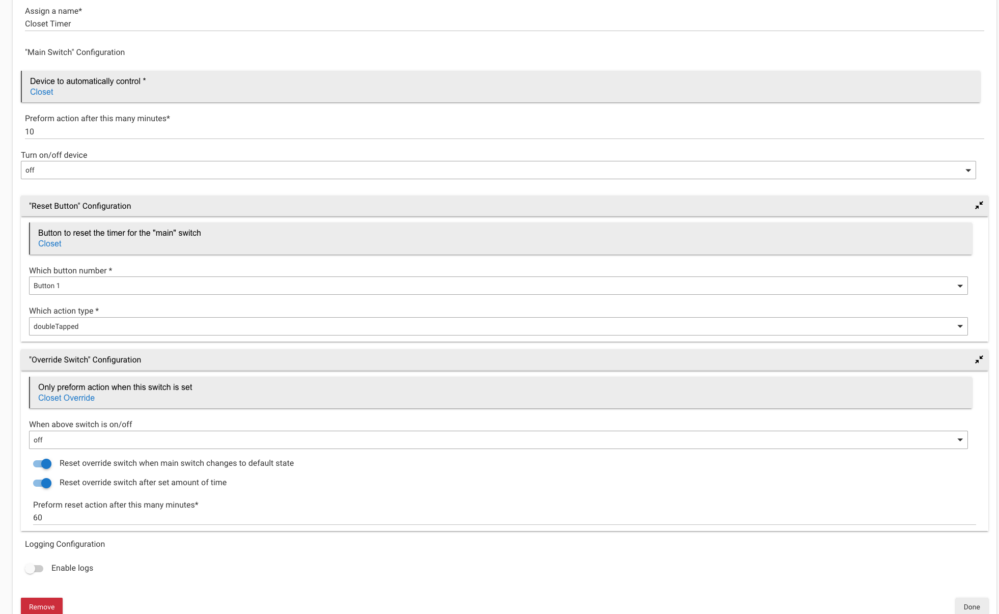

# Automatic Timer

## Overview
This app is designed to be used as a timer to automatically turn on/off a switch after a configurable
amount of time. Optionally, you may configure an override switch which prevents the timer from running.
In addition to controlling the main switch, this app will also manage state of the override switch if
desired.

## Features
- Automatically turn off "main" switch after set amount of time
- [Optional] Configure "override switch" that will prevent timer from running
- [Optional] Set the "override switch" back to default when the "main" switch changes to default state (defined as
    the opposite of the "mainOnOffSetting")
- [Optional] Set the "override switch" back to default state (defined as the opposite of the "overrideOnOffSetting")
    after set amount of time
  - Note: There is no override for this timer. This effectively puts a cap on the amount of time your "main" switch 
    can remain on/off as when this resets it'll trigger the timer countdown for the "main" switch.  

## Usage
Add code for parent app and then and child app. Install/create new instance of parent app and begin using.

### Example
Here we'll walk through the setup of an app

1. Assign a name
2. Select the "main" switch.
    - This is the switch that you want to set on a timer
3. Enter how many minutes you'd like to time this switch for
4. Select whether you want to turn this switch on or off at the end of the configured minutes
    - DO NOT select "No selection". This will break your app. Perhaps I'll fix this to be a bool one day.
    - Depending on what you select, the app will automatically check for when the "main" switch does the opposite and start a timer
5. Optionally select an override switch
    - This is used if you'd like some way to prevent the timer from running. I primarily use this with a jasco dimmer switch.
     If I'd like the light to stay on for longer than the set time, I'll turn on the override. I usually configure the 
     override by using double taps on the dimmer switch and the button controller. Maybe I'll include the button 
     configurations in this app at some point. 
6. Select whether you want the override switch to be on of off in order for the "main" switch timer to run
    - DO NOT select "No selection". This will break your app. Perhaps I'll fix this to be a bool one day.
7. Choose whether you want to reset the "override" switch when the "main" switch changes. 
    - In the example below, if the closet light turns off and closet override is on, then closet override will be turned off
    - This is just a quick helper to reset the "override" switch after I'm done using the "main" switch for an extended 
      period of time. Instead of having to remember to turn the "override" switch off in addition to the "main" switch,
      it'll just be reset when I turn off the "main" switch. 
8. Choose whether you want to set a hard limit on how long the override can be on
    - Useful if you forget to reset your override after use
    - Note: There is no override for this timer. This effectively puts a cap on the amount of time your "main" switch
      can remain on/off as when this resets it'll trigger the timer countdown for the "main" switch.
9. Enter how many minutes you would like the override switch to remain on

## Anatomy
This app consists of a parent, used essentially for grouping, and a child app which preforms all the logic. 

There is meant to be one child app for each switch you want to put on a timer. 