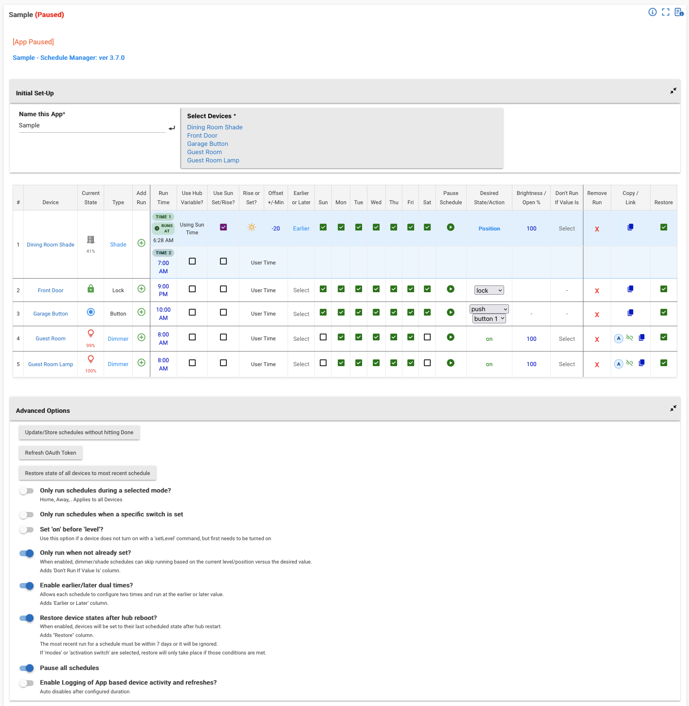

# Schedule Manager

## Overview
This app provides a timetable for scheduling device states, levels, positions, and actions. Each device can have any number of schedules, and schedules can be copied or kept synchronized across compatible devices.

See below for features and advanced options.

## Features
- Schedule any number of switches, dimmers, window shades, buttons, locks, and garage doors
- Schedules based on selected time or sunrise/set with offset
- Schedules based on Hub Variable time (date, time or datetime)
- Individual schedules may be paused
- Set the desired state, level, shade position, or action at each scheduled time
- Copy a schedule to other configured devices of the same selected type
- Link copied schedules so future edits remain synchronized across devices

## Advanced Options
1. [Optional] Configure modes for which the schedule should apply
   - [Optional] Turn off devices when mode changes to an unselected mode
   - [Optional] Restore devices to latest schedule when mode changes to a selected mode
2. [Optional] Configure a switch which must be set for a schedule to be applied
3. [Optional] Turn "on" devices before issuing "setLevel" command.
   - Useful when a device doesn't turn on via a setLevel command
4. [Optional] Pause all schedules
5. [Optional] Restore device settings to latest schedule when hub reboots
   - When enabled, may be configured on a per-schedule basis
6. [Optional] Enable dual times to run at the earlier or later value per schedule
7. [Optional] Configure dimmer or shade schedules not to run if the device is already above/below the scheduled level or position

## Usage
Add the code for both the parent and child apps. Install a new instance of the parent app and begin using it.

You may also install via Hubitat Package Manager. Search for "Schedule Manager" and follow installation instructions.

The child app requires OAuth in order to edit schedules. You can enable this by opening the Hubitat sidenav and clicking 
"Apps Code". Find "Schedule Manager (Child App)" and click it. This opens code editor. On the top right, click the 
three stacked dots to open the menu and select "OAuth" > "Enable OAuth in App". 

If you ever update your OAuth token, you must click 'Refresh OAuth Token' in the 'Advanced Options' of each child 
instance in order for the app to get the new token.

### Example
Here we'll walk through the setup of an app:
1. Assign a name
2. Select any number of devices to control.
    - They will automatically appear in a table below
    - You must have at least one schedule for a device (you cannot remove all of them)
3. Set up the table of schedules how you'd like it
   - You may click the "Type" of a device to change the capability you're controlling (if there are multiple capabilities)
   - Click the "+" under "Add Run" to add new schedules for a device
   - Configure a static time for a schedule
   - Or configure a device to run at a Hub Variable time or at sunrise/set (with offset)
   - Check which days the schedule should apply
   - Enable/pause a schedule
   - Configure the desired state, level, position, or action of a device
   - Copy or link schedules to other devices of the same type
   - You may remove a schedule by clicking the "X" next to a schedule

Click **Done** or **Update** after making changes so Hubitat stores the configuration and rebuilds the scheduled jobs.

### Copying and Linking Schedules

Use the copy icon in the **Copy / Link** column to choose one or more compatible target devices.

- Leave **Keep these in sync** unchecked to create independent copies. Later edits to the source do not affect them.
- Enable **Keep these in sync** to create a linked group. Editing the time, days, pause/restore settings, desired value, or action on any member updates the other members.
- A target already in the same linked group is skipped instead of receiving a duplicate schedule.
- Button schedules are only copied when the target supports the selected action and button number.

Linked schedules display a matching letter badge, such as **A** or **B**, beside the unlink icon. Select the badge to see every device and effective run time in that group. Select the unlink icon to detach that schedule while leaving its configuration in place. If only one member remains, it is automatically changed back to an independent schedule.

Changing a device's selected type unlinks that device's linked schedules because schedule fields are not necessarily compatible across types. Schedule Manager displays a confirmation before making this change. Other members remain linked when at least two are left.

## Anatomy
This app consists of a parent, used essentially for grouping, and a child app which performs all the logic.

You may add as many child apps with as many devices as you'd like. I find it helpful to group child apps by similar
schedules rather than just throw everything into a single instance.
