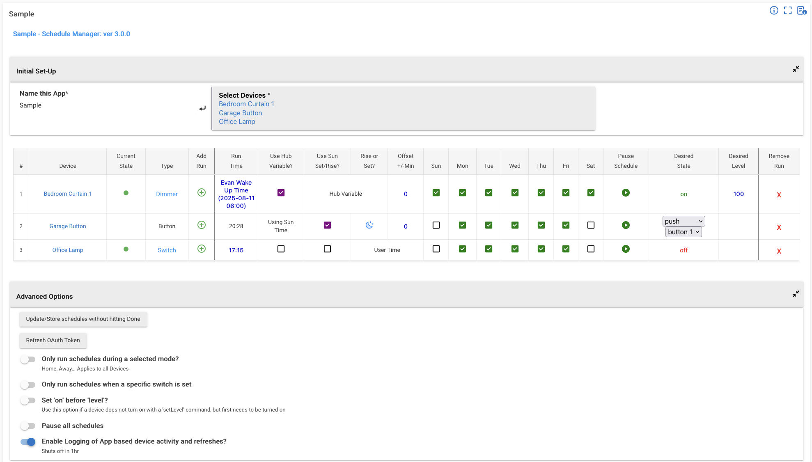

# Schedule manager

## Overview
This app allows users to configure a time table, per device, and schedule the desired state for each configured time. 
Users can select any number of switches/dimmers/buttons, schedule them based on a set time, hub variable or sunrise/set (with offset), 
and configure the desired state/action for that time. Additionally, users can pause the schedule for individual times. 
Advanced options include only running for desired modes or when a specific switch is set in addition to the ability 
to manually pause all schedules.

## Features
- Schedule any number of switches/dimmers/buttons
- Schedules based on selected time or sunrise/set with offset
- Schedules based on Hub Variable time (date, time or datetime)
- Individual schedules may be paused
- Set desired state for switch/dimmer to be in at specified time
- [Optional] Configure which modes to run schedules for
- [Optional] Configure "override switch" that will prevent schedules from running
- [Optional] Option to pause all schedules
- [Optional] Restore device settings to latest schedule when hub reboots
  - When enabled, may be configured on a per-schedule basis

## Usage
Add code for parent app and then and child app. Install/create new instance of parent app and begin using.

You may also install via Hubitat Package Manager. Search for "Schedule Manager" and follow installation instructions.

The child app requires OAuth in order to edit schedules. You can enable this by opening the Hubitat sidenav and clicking 
"Apps Code". Find "Schedule Manager (Child App)" and click it. This opens code editor. On the top right, click the 
three stacked dots to open the menu and select "OAuth" > "Enable OAuth in App". 

If you ever update your OAuth token, you must click 'Refresh OAuth Token' in the 'Advanced Options' of each child 
instance in order for the app to get the new token.

### Example
Here we'll walk through the setup of an app
1. Assign a name
2. Select any number of devices to control.
    - They will automatically appear in a table below
    - You must have at least one schedule for a device (you cannot remove all of them)
3. Set up the table of schedules how you'd like it
   - You may click the "Type" of a device to change the capability you're controlling (if there are multiple capabilities)
   - Click the "+" under "Add Run" to add new schedules for a device
   - Configure a static time for a schedule
   - Or configure a device to run at a Hub Variable time or at sunrise/set (with offset)
   - Check which days the schedule should apply
   - Enable/pause a schedule
   - Configure the desired state, level or action of a device
   - You may remove a schedule by clicking the "X" next to a schedule

Advanced Options
1. [Optional] Configure modes for which the schedule should apply
2. [Optional] Configure a switch when must be set for a schedule to be applied 
3. [Optional] Turn "on" devices before issuing "setLevel" command.
   - Useful when a device doesn't turn on via a setLevel command
4. [Optional] Pause all schedule
5. [Optional] Restore device settings to latest schedule when hub reboots
   - When enabled, may be configured on a per-schedule basis

## Anatomy
This app consists of a parent, used essentially for grouping, and a child app which preforms all the logic. 

You man add as many children apps with as many devices as you'd like. I find it helpful to group child apps by similar
schedules rather than just throw everything into a single instance.